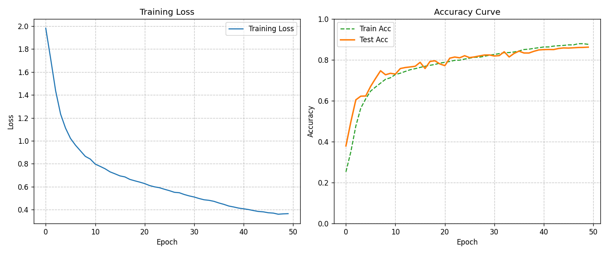

# Final Project for course AI_Programming

得分：19.5/20

## Task1

使⽤ PyTorch 中的卷积神经⽹络 (CNN) 来完成 CIFAR-10 数据集的图像分类。

### 运行代码

```
cd Task1
python HW1.py
```

## Task2

使用PyTorch的数据并行机制提高CIFAR-10训练的效率并进行对比。

### 运行代码

1. 确保安装了`torch`和`torchvision`
2. 切换并行/单卡：如果要运行双卡模式，请确保`torch.cuda.device_count() > 1`。若要强制单卡运行，可以手动注释`model = nn.DataParallel(model)`
3. 执行命令：`python task2.py`

## Task3

基于本学期前几次作业完成的cuda算子，基于cuda、pybind11、python等语言自主实现一个简单卷积网络，完成CIFAR-10数据集的图像分类任务。

在作业的基础上增加了Dropout和BN层，使用DeepVGG网络进行训练达到86%正确率，单epoch耗时15s左右

### 实验结果

**性能表格**
|阶段/模型配置|训练集准确率|测试集准确率|单Epoch耗时|	说明|
|--|--|--|--|--|
|Baseline (仅卷积+全连接)|	~77%|	~64%|	 s	|基础实现，易过拟合且收敛慢|
|+ Data Augmentation & Momentum|	~78%|	~72%|	9 s|	引入数据增强和动量优化|
|+ BN & Dropout (Final)	|87%	|86%	|15s|完整的深度网络，收敛极快|

```
Epoch 50/50 | LR: 0.00012 | Loss: 0.3645 | Train Acc: 87.57% | Test Acc:
86.19%
```

> 训练集与测试集的 Loss 下降曲线（左）与 Accuracy 上升曲线（右）。可以看出，随着余弦退⽕策略的⽣效，后期准确率有明显的爬升，且 Train/Test 差距较⼩，说明 Dropout 有效抑制了过拟合。
> 
### 文件结构

```
Task3/
├── autograd.py # ⾃定义⾃动微分框架（Tensor、SGD 实现）
├── cnn_module.cu # CUDA 核⼼实现：卷积、池化、Dropout、BN
等算⼦
├── cnn_module.h # CUDA 算⼦头⽂件
├── pybind.cpp # Pybind11 绑定代码（Python 调⽤ CUDA 算⼦的
接⼝）
├── setup.py # Python 扩展编译配置⽂件
├── train1.py # 基础训练脚本
├── train2.py # 两层卷积+零层全连接的训练脚本
├── train3.py # 带Dropout的训练脚本
├── train4.py # 带Batch Normalization的训练脚本
├── train5.py # 最终训练脚本
```

### 运行代码

**环境依赖**：Python 3.x, CUDA Toolkit, PyTorch (仅⽤于下载数据), Matplotlib

**CUDA Version**：11.8

```
cd Task3
python setup.py develop
python train5.py
```
